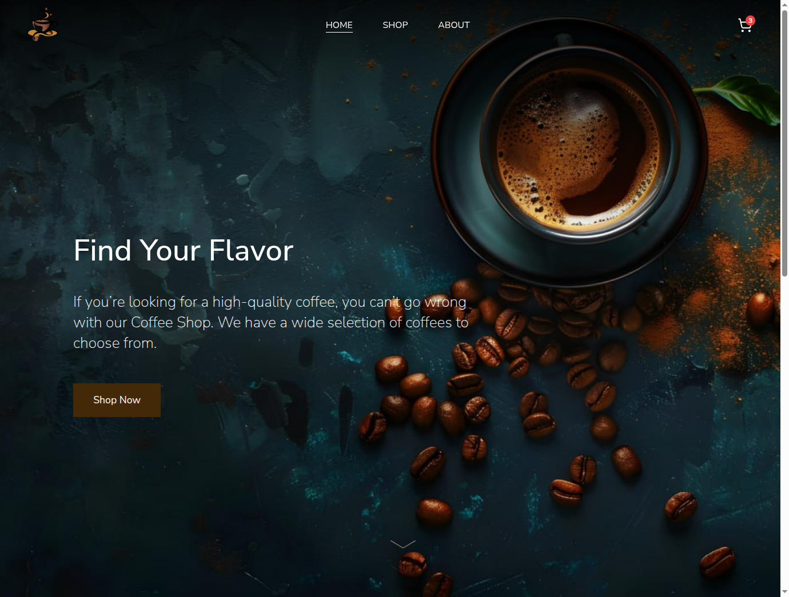
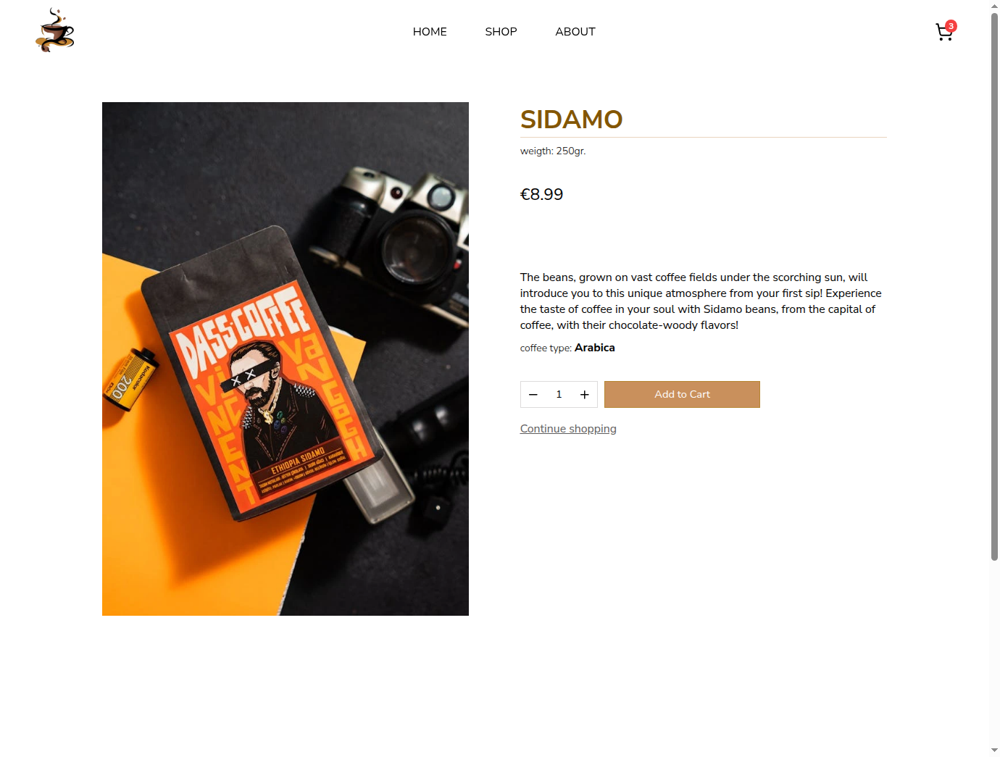

# Coffee Shop

[Live Version](https://nrg-coffee-shop.netlify.app/) 

A mock e-commerce site built in ReactJS, this project focuses on practising routing, automated testing (Vitest, React Testing Library) and styling React apps (CSS modules). All pages are responsive on desktop, tablet and mobile screens. 

## Acknowledgements

- [Clker-Free-Vector-Images](https://pixabay.com/users/clker-free-vector-images-3736/) for the favicon
- [deeznutz1](https://pixabay.com/users/deeznutz1-3086161/) for the background image
- [dorukhan pekcan](https://www.pexels.com/@dorukhan-pekcan-102942430/) for DASS COFFEE images
- [Agencia Bonito](https://www.pexels.com/@agencia-bonito-1849970458/) for WR4 coffee images
- [pratik prasad](https://www.pexels.com/@pratik-prasad-3736245/) for Colombian Brew coffee image
- [Hai Pham](https://www.pexels.com/@haipham07/) for Cà phê coffee image
- [GDJ](https://pixabay.com/users/gdj-1086657/) for the coffee beans map image
- [ninikvaratskhelia_](https://pixabay.com/de/users/ninikvaratskhelia_-15913392/) for the coffee cup image
